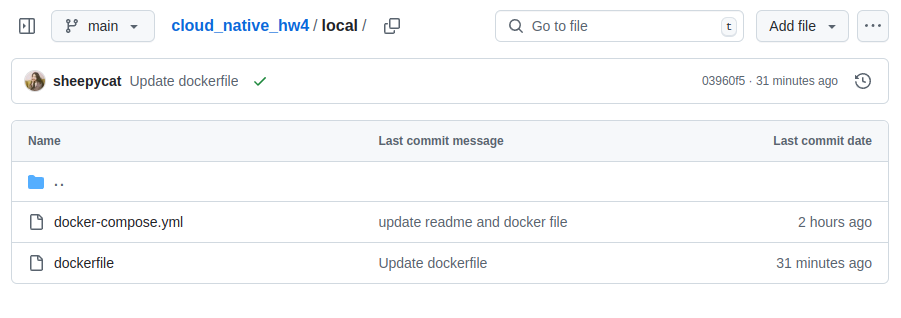
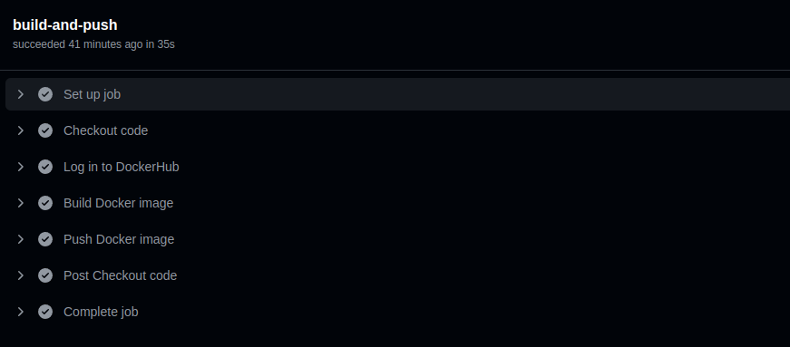
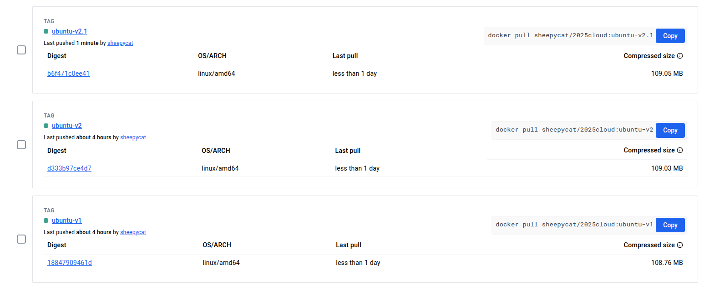

# cloud_native_hw4
* Docker Hub: [sheepycat/2025cloud](https://hub.docker.com/r/sheepycat/2025cloud/tags)

## Set up environment
### Clone Repo
```bash
git clone https://github.com/sheepycat/cloud_native_hw4.git
```

* Use docker-compose.yml to help building and running. Settings can be modified in the file. (binding port, docker hub repo, binding dir...etc)
### build image from local
```bash
cd local

# This will automatically build the image using the Dockerfile and run the container：
sudo docker-compose up -d

```
### Use Pre-Built image from Docker Hub
```bash
cd built

# This will pull the pre-built image from Docker Hub and run the container：
sudo docker-compose up -d
```
## Automated Docker Image Workflow

This project uses GitHub Actions to automatically build and push Docker images to Docker Hub. The automation is triggered only when changes are made to the local/ directory of the [main branch](https://github.com/sheepycat/cloud_native_hw4/tree/main).

---
### Local/  usage
The local/ directory contains the current Dockerfile (based on Ubuntu 24.04) and docker-compose.yml.

Users can test and edit locally. Once they attempt to merge changes in local/ to the main branch, a GitHub Action will check whether the files can be built successfully. If the build succeeds, the Docker image will be automatically pushed to Docker Hub; otherwise, the pull request will fail.


### The workflow does the following:

1. Checkout the repository
2. Log in to Docker Hub using secrets
3. Build the Docker image from the ./local directory
4. Push the image to Docker Hub as sheepycat/2025cloud:ubuntu-vX.X



### Tags

Image tag format is: ubuntu-vX.X (e.g., ubuntu-v2, ubuntu-v2.1)

* ubuntu-v1 is based on ubuntu 22.04
* ubuntu-v2 is based on ubuntu 24.04

The current GitHub Action builds and pushes version ubuntu-v2.1 automatically when changes are made under the local/ directory.

